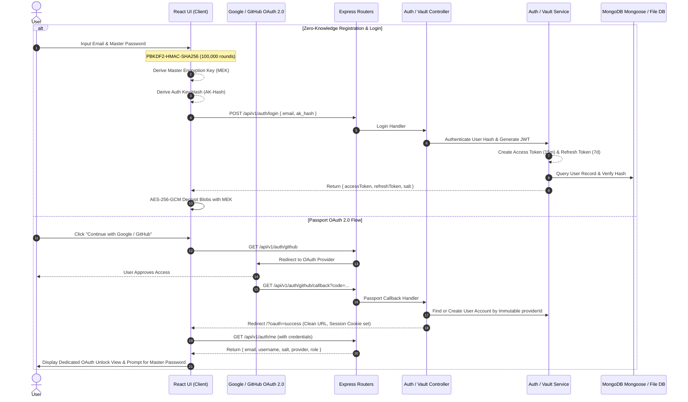

# Zero-Knowledge Password Manager & Vault Engine: System Architecture

An enterprise-grade, zero-knowledge password vault and generator built with **Vite, React, TypeScript, Node.js, Express, and MongoDB**.

This system is engineered specifically to demonstrate **Zero-Knowledge Security Protocols**, **Dual-Token JWT Authentication**, **Immutable OAuth Provider Indexing**, **MongoDB Mongoose ODM Persistence**, **Offline-First Synchronization**, and **High-Performance Computational Engines** in production.

---

## 1. High-Level System Architecture

```mermaid
graph TD
    subgraph Client Browser [Client Tier - Browser]
        UI[React + TS Dashboard UI]
        Inspector[Engine & System Design Inspector Panel]
        AdminUI[Admin Console Telemetry Dashboard]
        SessionStore[sessionStorage Session Retention]
        IDB[(Encrypted IndexedDB Storage)]

        subgraph Vault Engine Suite
            TrieEngine[Trie: O-K Vault Search & Auto-Complete]
            BloomEngine[Bloom Filter: Offline Breach Check]
            StrengthEngine[Password Strength Engine: Entropy & Pattern Detection]
            LRUEngine[LRU Cache: Decrypted Password Store]
            GeneratorEngine[CSPRNG Rejection Sampling & Entropy]
            DPAudit[Levenshtein DP: Password Reuse Audit]
        end
    end

    subgraph Layered Express Server [Backend Tier - Express Router / Controller / Service]
        subgraph Middlewares
            Limiter[Token Bucket Rate Limiter]
            AuthGuard[RequireAuth JWT Guard Middleware]
            AdminGuard[RequireAdmin RBAC Guard Middleware]
        end

        subgraph Routers
            AuthRouter["/api/v1/auth Router"]
            VaultRouter["/api/v1/vault Router"]
            HealthRouter["/api/v1/health Router"]
            AdminRouter["/api/v1/admin Router"]
        end

        subgraph Controllers
            AuthController[Auth, JWT & OAuth Controller]
            VaultController[Vault Sync Controller]
            HealthController[Health Check Controller]
            AdminController[Admin Telemetry Controller]
        end

        subgraph Services & Persistence Layer
            PassportConfig[Passport Google & GitHub OAuth Strategy]
            AuthService[Auth & User Service - JWT & OAuth]
            VaultService[Vault Sync Service]
            MongoDB[(MongoDB Atlas Mongoose ODM Store)]
            FileDB[(Persistent Local File Fallback server/data/db.json)]
        end
    end

    UI <--> Inspector
    UI <--> AdminUI
    UI <--> TrieEngine
    UI <--> BloomEngine
    UI <--> StrengthEngine
    UI <--> LRUEngine
    UI <--> GeneratorEngine
    UI <--> DPAudit
    UI <--> IDB
    UI <--> SessionStore

    UI -- "HTTPS / Bearer JWT" --> Limiter
    Limiter --> Routers
    AuthRouter --> AuthController
    VaultRouter --> AuthGuard
    AuthGuard --> VaultController
    HealthRouter --> HealthController
    AdminRouter --> AdminGuard
    AdminGuard --> AdminController

    AuthController --> AuthService
    AuthController --> PassportConfig
    VaultController --> VaultService
    AdminController --> AuthService
    AdminController --> VaultService
    AuthService <--> MongoDB
    AuthService <--> FileDB
    VaultService <--> MongoDB
    VaultService <--> FileDB

    style Client Browser fill:#1a1d24,stroke:#3b82f6,stroke-width:2px,color:#fff
    style Layered Express Server fill:#111827,stroke:#10b981,stroke-width:2px,color:#fff
    style Vault Engine Suite fill:#1f2937,stroke:#8b5cf6,stroke-width:1px,color:#fff
```



---

## 2. Zero-Knowledge Cryptographic & Dual-Token JWT Protocol



### Key Separation & Zero-Knowledge Guarantee
- **Master Encryption Key (MEK)**: Derived on the client via `PBKDF2-HMAC-SHA256` with 100,000 iterations using `Master Password + User Salt`. Used exclusively for local `AES-256-GCM` encryption/decryption. **NEVER** sent across the network or stored on the server.
- **Authentication Key (AK)**: Derived independently: `AK = HMAC-SHA256(MEK, "auth-key-derivation")`. Hashed before transmission to authenticate with the server. Even if the server database is compromised, an attacker cannot derive the MEK or decrypt vault items.
- **Dual-Token JWT Authentication**: Short-lived JWT Access Tokens (`15m`) and long-lived Refresh Tokens (`7d`) manage API authorization. Transmitted via `Authorization: Bearer <accessToken>` headers.
- **Immutable OAuth `providerId` Indexing**: OAuth accounts are indexed by their permanent provider ID (`providerId`). If a user updates their email address on Google or GitHub, the backend automatically updates `user.email` without creating duplicate accounts or losing encrypted vault entries.

---

## 3. Modular Backend Layered Architecture (`server/`)

The backend is structured around clean enterprise separation of concerns:

```
server/
├── config/
│   ├── db.js                # MongoDB Mongoose connection & persistent file DB fallback
│   └── passport.js          # Google & GitHub Passport.js strategy configs (dynamic providerId checks)
├── controllers/
│   ├── adminController.js   # Admin telemetry & metrics HTTP handlers
│   ├── authController.js    # Auth, JWT & OAuth HTTP request/response handlers
│   ├── vaultController.js   # Vault sync & pull HTTP handlers
│   └── healthController.js  # health check endpoint
├── middlewares/
│   ├── authMiddleware.js    # JWT requireAuth & RBAC requireAdmin guard middlewares
│   └── rateLimiter.js       # Token Bucket rate limiter middleware
├── models/
│   ├── User.js              # Mongoose User Schema (email, username, salt, authKeyHash, provider, providerId, role)
│   └── Vault.js             # Mongoose Vault Schema (email, encryptedItems array)
├── routes/
│   ├── adminRoutes.js       # /api/v1/admin Router (guarded by requireAdmin)
│   ├── authRoutes.js        # /api/v1/auth Router (register, login, refresh, me, user-info, oauth)
│   ├── vaultRoutes.js       # /api/v1/vault Router (guarded by requireAuth)
│   └── healthRoutes.js      # /api/v1/health Router
├── services/
│   ├── authService.js       # JWT generation, verification & persistent user service
│   └── vaultService.js      # Encrypted vault synchronization business logic
├── app.js                   # Main Express application setup & router mounts
└── index.js                 # Server entry point listening on Port 3001
```

---

## 4. High-Performance Vault Engine Blueprint (`src/engines/`)

### A. Trie Engine (`trie.ts`) — Instant $O(K)$ Vault Search
- **Data Structure**: Multi-way tree where each node represents a character of application names or domain URLs (e.g., `github.com`, `google.com`).
- **Time Complexity**: Insert $O(L)$, Search $O(K)$, Auto-complete prefix match $O(K + M)$ where $K$ is prefix length and $M$ is matches returned.
- **Use Case**: Renders instant search results over thousands of stored credentials without main-thread latency or full array scans ($O(N)$).

### B. Bloom Filter Engine (`bloomFilter.ts`) — Space-Efficient Offline Password Breach Detection
- **Data Structure**: Bit array of size $m = 958,505$ bits with $k = 7$ independent hash functions (MurmurHash3-lite).
- **Math & Optimal Parameters**:
  - Bit array size: $m = -\frac{n \ln p}{(\ln 2)^2}$
  - Optimal hashes: $k = \frac{m}{n} \ln 2$
- **Use Case**: Instant client-side check against 100,000+ weak/common passwords with **0 false negatives** and a controlled <1% false positive rate in under 117 KB of memory.

### C. Password Strength Engine (`strengthEngine.ts`) — Multi-Metric Security Evaluation
- **Metrics Evaluated**:
  1. **Shannon Entropy**: $H = L \times \log_2(R)$
  2. **Keyboard Walk Sequences**: Detects horizontal/vertical spatial walks (`qwerty`, `12345`).
  3. **Repetitive Character Runs**: Identifies sequential character repetitions (`aaaa`, `1111`).
  4. **Bloom Filter Dictionary Breach**: Cross-references against 50+ common dictionary & default IoT passwords.
- **Use Case**: Powers the visual Security Audit Dashboard and flags **Weak Password** cards in the vault UI.

### D. CSPRNG & Rejection Sampler Engine (`generator.ts`) — Cryptographically Unbiased Password Generator
- **Algorithm**: Rejection sampling over `window.crypto.getRandomValues()`.
- **True Shannon Entropy Calculation**: $H = L \times \log_2(R)$
- **Fisher-Yates Shuffle**: Guarantees uniform permutation after combining user constraints.

### E. LRU Cache Engine (`lruCache.ts`) — Memory-Hygiene Vault Item Caching
- **Data Structure**: Doubly-Linked List + Hash Map (`Map<string, Node>`).
- **Eviction Policy**: Fixed capacity with 5-minute Time-To-Live (TTL).
- **Security Hardening**: Upon eviction or manual lock, node string references are dropped (`(node as any).value = ''`) to trigger immediate V8 garbage collection sweep.

### F. Levenshtein Distance DP Engine (`levenshtein.ts`) — Vault Security Audit
- **Algorithm**: Matrix-based DP edit distance computation between stored passwords.
- **Time Complexity**: $O(|S_1| \times |S_2|)$.
- **Use Case**: Detects reused or slightly variant passwords (e.g. `Secret123!` vs `Secret1234!`) and flags security risks.

---

## 5. Deployment Architecture

```
                       ┌──────────────────────────────────────────┐
                       │  ┌────────────────────────────────────┐  │
                       │  │            Web Service             │  │
                       │  │                                    │  │
                       │  │  1. Express API (/api/v1/*)        │  │
                       │  │  2. JWT Access & Refresh Tokens    │  │
                       │  │  3. Token Bucket Rate Limiter      │  │
                       │  │  4. Passport OAuth (Google/GitHub) │  │
                       │  │  5. RBAC Admin Telemetry (/admin)  │  │
                       │  │  6. Serves React Dist (/dist)      │  │
                       │  └──────────────────┬─────────────────┘  │
                       └─────────────────────┼────────────────────┘
                                             │ HTTPS
                                             ▼
                                ┌───────────────────────────┐
                                │  MongoDB Atlas Free Tier  │
                                │   (Encrypted Blobs Only)  │
                                └───────────────────────────┘
```

---

## 6. Security & Threat Model Summary

| Threat Vector | Mitigation Strategy |
| :--- | :--- |
| **Database Leak / Server Compromise** | Server stores ONLY AES-256-GCM encrypted ciphertext blobs and hashed auth tokens in MongoDB. Zero access to Master Passwords or decryption keys. |
| **Man-In-The-Middle (MITM)** | TLS 1.3 encryption on Render + Client-side zero-knowledge key derivation ensures plaintext passwords never cross the wire. |
| **Identity Parameter URL Leaks** | OAuth callback sets session cookie and redirects to clean URL (`/?oauth=success`). Frontend fetches session securely via `/api/v1/auth/me`. |
| **Token Hijacking & Expiration** | Dual-token JWT system: short-lived Access Tokens (`15m`) and long-lived Refresh Tokens (`7d`) with `/api/v1/auth/refresh`. |
| **Account Email Changes on OAuth** | Accounts indexed by immutable `providerId`. Email updates on Google/GitHub automatically sync without duplicate account creation. |
| **Unprivileged Admin Access** | `requireAdmin` middleware verifies `user.role === 'admin'`. UI conditionally renders Admin Console controls only for authorized admins. |
| **Memory Dump / Heap Inspection** | Decrypted passwords in LRU Cache auto-expire with string reference clearing for V8 GC sweep. |
| **Brute-Force & Credential Stuffing** | Token Bucket Rate Limiting per IP + PBKDF2 high work-factor (100,000 iterations). |
